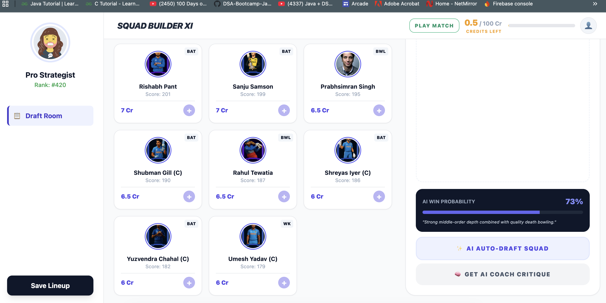
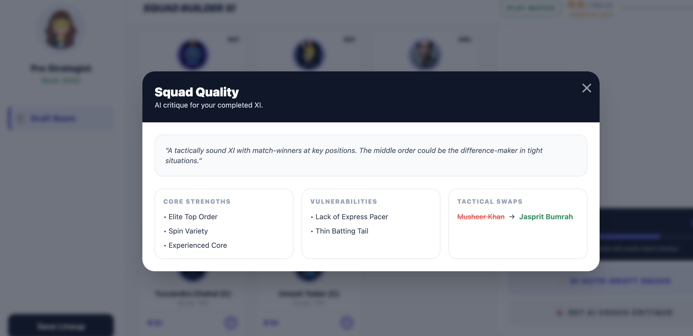
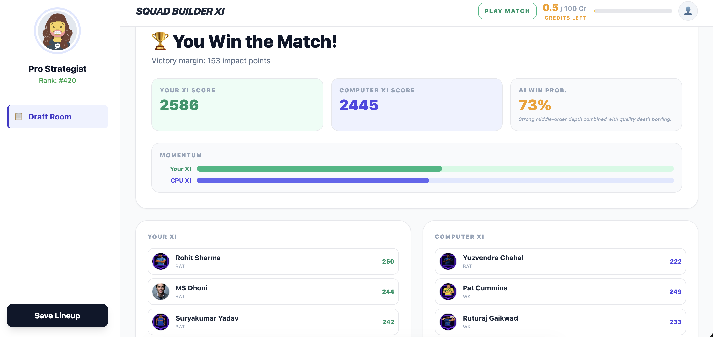

# Cricket Squad Builder

An AI-assisted fantasy cricket squad builder and match simulator. The frontend lets users draft a balanced 11-player team under budget constraints, while the Firebase backend enforces all game rules, simulates matches, and provides Gemini-powered insights.

## Screenshots





## What this project does

- Build a squad of 11 players within budget and role caps.
- Validate drafts server-side with Firestore transactions.
- Simulate 20-over matches with weighted probability outcomes.
- Get AI coach suggestions, player analysis, and team audits via Gemini.

## Tech stack

- Frontend: Angular 21 + Tailwind CSS
- Backend: Firebase Cloud Functions (Node.js 18 + Express)
- Data: Firestore + Auth emulators
- AI: Google Gemini 1.5 Flash

## Architecture at a glance

```
frontend/cricket-squad-builder  →  Angular UI
backend/functions               →  Express API (Cloud Functions)
backend/firestore.rules         →  No client writes; server-authoritative logic
```

Key backend modules live under [backend/functions](backend/functions):

- `engines/validationEngine.js` for draft rules
- `engines/matchEngine.js` for match simulation
- `engines/coachEngine.js` for strategic suggestions
- `engines/aiEngine.js` for Gemini insights

## API endpoints (selected)

- `GET /health`
- `POST /auth/signup`, `POST /auth/login`
- `GET /draft/players`, `GET /draft/bossTeams`
- `POST /draft/start`, `POST /draft/updateDraft`, `POST /draft/removeDraft`
- `POST /match/runMatch`
- `POST /coach/getCoachInsights`
- `POST /ai/auto-suggest`, `GET /ai/player-analysis/:id`, `POST /ai/team-analysis`, `POST /ai/win-probability`

## Getting started

### 1) Backend (Firebase emulators)

From the repo root:

```bash
cd backend
firebase emulators:start
```

Seed the database in another terminal:

```bash
cd backend/functions
FIRESTORE_EMULATOR_HOST=localhost:8080 FIREBASE_AUTH_EMULATOR_HOST=localhost:9099 node seed.js
```

The API will be available at:

```
http://localhost:5001/cricket-squad-game/us-central1/api
```

### 2) Frontend (Angular)

```bash
cd frontend/cricket-squad-builder
npm install
npm run start
```

Open:

```
http://localhost:4200
```

The Angular dev server proxies `/api` to the local Firebase function (see [frontend/cricket-squad-builder/proxy.conf.json](frontend/cricket-squad-builder/proxy.conf.json)).

## Configuration

Set the Gemini API key for AI features:

```bash
export GEMINI_API_KEY=your_key_here
```

If the key is missing, the AI routes will fail with an error.

## Demo credentials

The seed script creates a demo account:

- Email: `test@example.com`
- Password: `password123`

## Development notes

- All draft mutations are validated server-side and run inside Firestore transactions.
- Client writes are blocked by [backend/firestore.rules](backend/firestore.rules).
- Match simulation uses weighted probabilities and small randomness to keep outcomes plausible.

## Project structure

```
backend/
	functions/
		engines/
		middleware/
		routes/
		data/
frontend/
	cricket-squad-builder/
```
